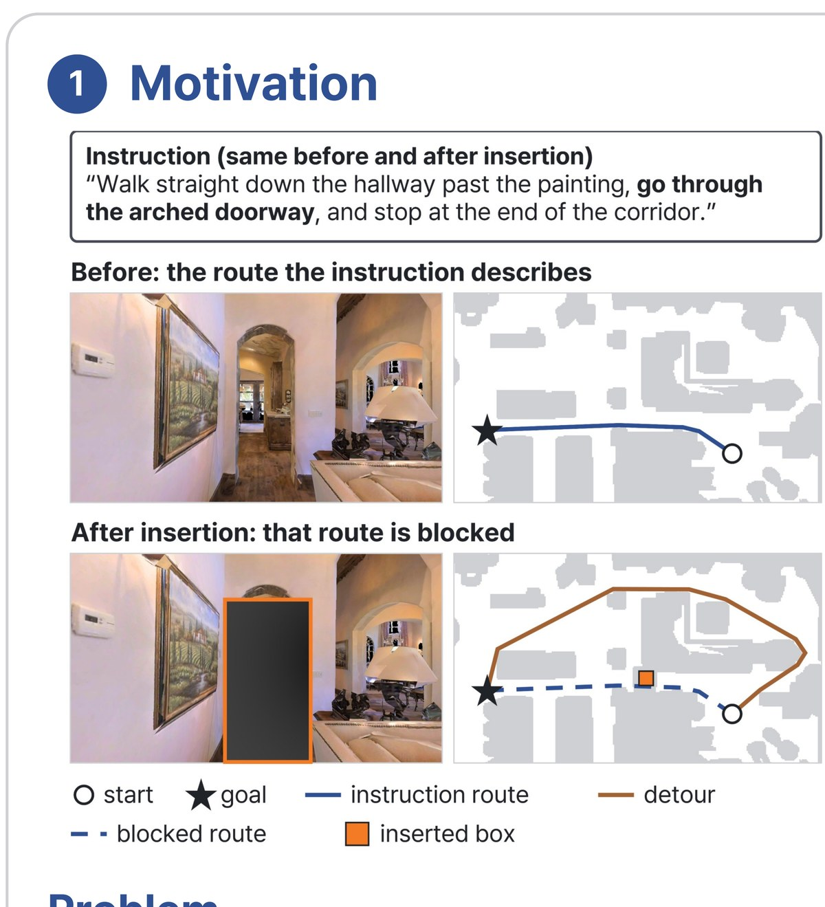
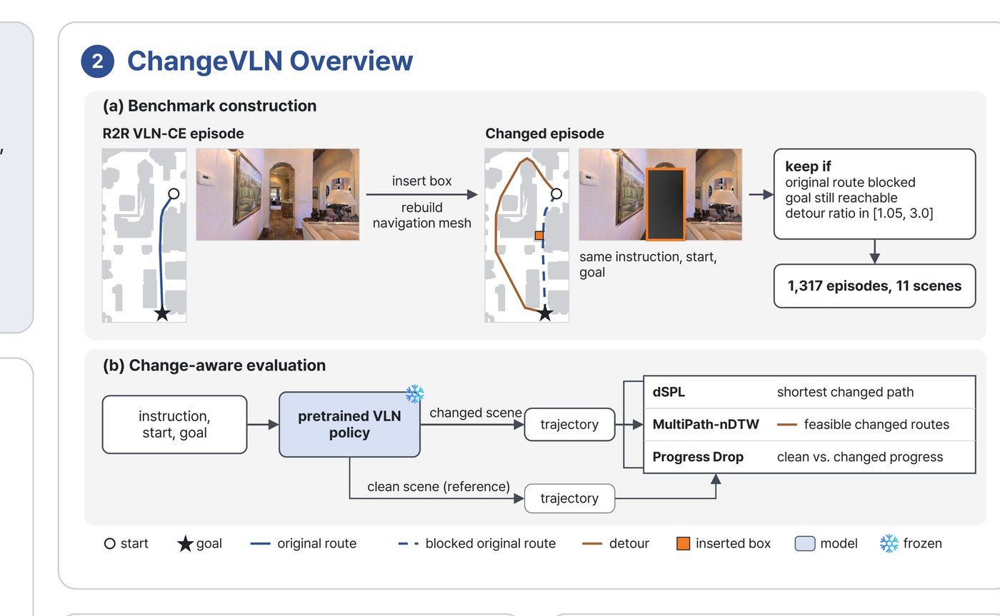
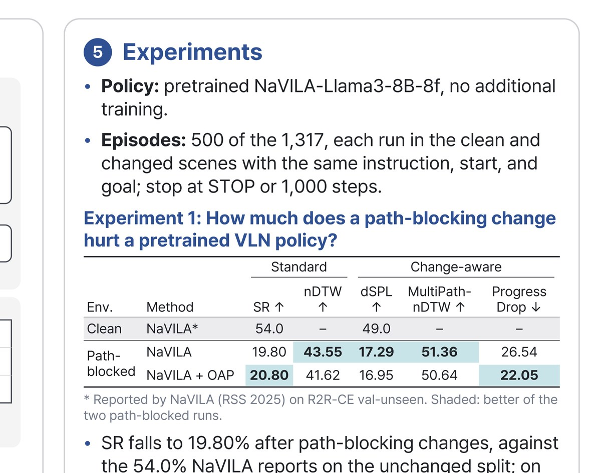

# ChangeVLN

**A Benchmark for Vision-Language Navigation in Changed Environments**

ChangeVLN evaluates how Vision-Language Navigation (VLN) agents behave when the physical environment changes after the navigation instruction has already been generated.

The project was developed as an undergraduate research project and was accepted to the **IEEE/RSJ IROS 2026 Workshop on Semantic and Metric Navigation (SeMaNa)**.

**Paper:** [ChangeVLN: A Benchmark for Vision-Language Navigation in Changed Environments](https://openreview.net/forum?id=HaTMBqlK1B)

<p align="center">
  
</p>

<p align="center"><em>The instruction, start, and goal stay fixed while an inserted obstacle blocks the original route and forces a detour.</em></p>

---

## Motivation

Most VLN benchmarks evaluate agents in environments that remain consistent with the original instruction and reference trajectory.

Real environments can change after an instruction is created. Furniture may be moved, passages may become blocked, and an agent may need to revise its behavior instead of blindly following the original route.

ChangeVLN introduces controlled environmental changes and evaluates whether a VLN agent can respond appropriately.

---

## Benchmark Overview

<p align="center">
  
</p>

The benchmark is built on a **NaVILA-based navigation pipeline in Habitat**.

The evaluation process includes:

1. Select navigation episodes from the original VLN benchmark.
2. Introduce obstacles that alter the original navigation environment.
3. Reconstruct the navigation mesh after the environmental change.
4. Compare clean and changed navigation conditions.
5. Evaluate a baseline policy and an obstacle-aware replanning setting.
6. Compute episode-level and aggregate navigation metrics.

A total of **500 episodes** were used in the final evaluation.

- Preliminary results reused: **91 episodes**
- Newly executed episodes: **409 episodes**
- Baseline success: **99 / 500**
- Obstacle-aware setting success: **104 / 500**

<p align="center">
  
</p>

<p align="center"><em>Summary of the final comparison between NaVILA and the obstacle-aware instruction setting.</em></p>

---

## Public Code

This repository now includes a selected public subset of the research implementation.

```text
changevln/
├── changevln/
│   └── obstacle_injector.py
├── evaluation/
│   ├── compute_metrics_sub500.py
│   ├── gen_benchmark_manifest.py
│   ├── gen_obs100_manifest.py
│   └── run_sub500_eval.sh
├── replanning/
│   └── structured_replan_trainer.py
├── configs/
│   ├── base_clean.yaml
│   ├── base_obstacle.yaml
│   ├── oap_clean.yaml
│   └── oap_obstacle.yaml
├── requirements.txt
├── ATTRIBUTION.md
└── third_party/
    ├── NaVILA-APACHE-2.0.txt
    └── NaVILA-Bench-MIT.txt
```

### Key files

- **`changevln/obstacle_injector.py`**  
  Adds static or real-object obstacles in Habitat, rebuilds the NavMesh, and records placement statistics for changed-environment evaluation.

- **`evaluation/gen_benchmark_manifest.py`**  
  Builds the benchmark manifest used to organize obstacle-injected episodes.

- **`evaluation/run_sub500_eval.sh`**  
  Runs the final 409 newly evaluated episodes across Base/OAP and Clean/Obstacle settings.

- **`evaluation/compute_metrics_sub500.py`**  
  Combines the reused 91 episodes and the newly executed 409 episodes to calculate final 500-episode metrics.

- **`replanning/structured_replan_trainer.py`**  
  Implements the obstacle-aware structured replanning evaluation path.

- **`configs/`**  
  Contains the final Base/OAP × Clean/Obstacle evaluation configurations.

---

## Evaluation Pipeline

```text
Original VLN Episode
        │
        v
Environment Modification
(Obstacle Placement)
        │
        v
Navigation-Mesh Reconstruction
        │
        v
Base / Obstacle-Aware Evaluation
        │
        v
Trajectory & Episode Metrics
        │
        v
Final Benchmark Analysis
```

---

## My Contributions

My work focused on building and validating the changed-environment evaluation pipeline.

- Designed the benchmark setup for evaluating VLN agents under environmental changes
- Implemented obstacle insertion and environment modification in Habitat
- Analyzed the original instruction distribution to examine how obstacle-related situations were represented
- Built and refined the obstacle-aware prompting / replanning procedure
- Organized the 500-episode evaluation pipeline
- Executed baseline and obstacle-aware experiments
- Implemented scripts for episode-level statistics and final metric calculation
- Tracked reproducibility information such as episode IDs, obstacle poses, random seeds, and navigation-mesh changes
- Prepared the experimental results and paper for publication

---

## Technical Stack

- **Python**
- **Habitat-Lab / Habitat-Sim**
- **NaVILA**
- Vision-Language Navigation
- Vision-Language-Action models
- Navigation evaluation and experiment automation

---

## Reproduction Notes

The public repository contains the key research scripts and final evaluation configurations, but it does **not** include:

- model checkpoints / weights
- R2R / Matterport3D / Habitat datasets and scene assets
- full trajectory outputs
- large evaluation artifacts
- API keys or tokens

To run the code, the corresponding upstream NaVILA/Habitat environment and required datasets/checkpoints must be prepared separately.

The public files were selected from the final research pipeline and sanitized to avoid machine-specific absolute paths and secret values.

---

## Publication

**ChangeVLN: A Benchmark for Vision-Language Navigation in Changed Environments**

- Authors: **Sohee Kang, Nuri Kim**
- Venue: **IEEE/RSJ IROS 2026 Workshop on Semantic and Metric Navigation (SeMaNa)**
- Status: **Accepted**
- Paper: [OpenReview](https://openreview.net/forum?id=HaTMBqlK1B)

---

## Attribution

This work builds on open-source projects including **NaVILA** and **NaVILA-Bench**. Their original licenses and attribution are preserved under `third_party/`.

See [ATTRIBUTION.md](ATTRIBUTION.md) for details.
